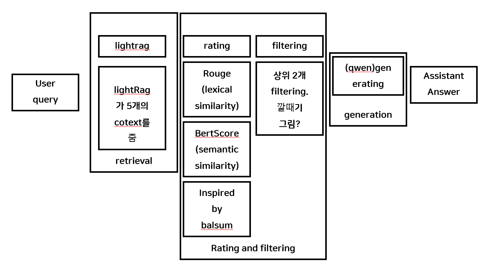

# AGI 발현을 위한 Self-Evolver에 대한 연구 개발 내용 4종 Github 공개
## 검색된 컨텍스트에 대해 입력 프롬프트와 관련성이 높은 컨텍스트를 평가 및 선별하는 Rating & Filtering 기법
## 💡 예시


## ⚙️ Requirements
To install requirements:
```
# 가상 환경 생성
conda create -n ragvenv python=3.10 -y
conda activate ragvenv

# 패키지 설치
pip install -e ./LightRAG
pip install -r requirements.txt
```

## 💻 Running RAG with Custom Filtering

./script/run.sh 스크립트를 실행하여 RAG 파이프라인을 테스트할 수 있습니다.

### Step 1. RAG에 삽입할 텍스트 파일 준비

먼저, ./data/sample.txt와 같이 RAG가 참조할 텍스트 파일을 준비합니다.

```text
LightRAG is a fast and simple RAG system.
It efficiently processes documents using graph-based retrieval.
It supports various LLMs and embedding models.
You can run it locally without an OpenAI API.
The system uses knowledge graphs to enhance retrieval accuracy.
The system also supports custom reranking functions for advanced filtering.
Netflix was founded by Reed Hastings and Marc Randolph.
Netflix introduced streaming in 2007.
"House of Cards" was the first major original series in 2013.
```

### Step 2. Reranker를 활성화하여 스크립트 실행

`--file`로 텍스트 경로를, `--rouge_weight`와 `--bert_weight`로 Reranker 가중치를 조절할 수 있습니다.

```bash
# 가중치를 반영하여 실행 (ROUGE 0.6, BERT 0.4)
python ./src/run.py --file ./data/sample.txt --rouge_weight 0.6 --bert_weight 0.4
```

- rouge_weight: ROUGE-L 기반 lexical similarity의 비중
- bert_weight: BERTScore 기반 semantic similarity의 비중

README 전체에서 예시는 ROUGE 0.6, BERTScore 0.4 가중치 조합을 기준으로 통일합니다.

## 🧪 예시 데모

아래는 ROUGE(0.6)와 BERTScore(0.4) 가중치를 적용하여 sample.txt에 질문하는 터미널 세션 예시입니다.

```text
(ragvenv) root@...:/workspace$ python ./src/run.py --file ./data/sample.txt --rouge_weight 0.6 --bert_weight 0.4

Initializing LightRAG...
[CustomReranker] ROUGE 가중치: 0.6, BERTScore 가중치: 0.4로 초기화됨
Loading embedding model: sentence-transformers/all-MiniLM-L6-v2
LLM model: Qwen/Qwen2.5-1.5B-Instruct
...
Loading document from ./data/sample.txt...
Inserting document...
...

Executing query...
Please enter your question: How does LightRAG enhance retrieval accuracy, and can I customize the ranking?

[Custom Reranker (Sync Job)] ROUGE+BERTScore로 5개 청크 재정렬...
[Custom Reranker (Sync Job)] BERTScore를 GPU(cuda)에서 실행합니다...
[Custom Reranker (Sync Job)] 개별 점수:
  Chunk 0: ROUGE-L=0.3529, BERT-F1=0.8541 -> Total=0.6656
  Chunk 1: ROUGE-L=0.4211, BERT-F1=0.7587 -> Total=0.6361
  Chunk 2: ROUGE-L=0.1250, BERT-F1=0.5190 -> Total=0.3226
  Chunk 3: ROUGE-L=0.0000, BERT-F1=0.4851 -> Total=0.1940
  Chunk 4: ROUGE-L=0.0000, BERT-F1=0.4578 -> Total=0.1831
[Custom Reranker (Sync Job)] 재정렬 완료.
[Custom Reranker (Sync Job)] 정렬된 dict 리스트 반환 중...

==================================================
Question: How does LightRAG enhance retrieval accuracy, and can I customize the ranking?
(QueryParam: mode=hybrid, chunk_top_k=2, rerank=True)
==================================================
Answer: LightRAG enhances retrieval accuracy by utilizing knowledge graphs. Additionally, it supports custom reranking functions for advanced filtering.
==================================================
```

위 점수 예시는 설명을 위한 샘플 값이며, 실제 점수는 환경과 랜덤 시드에 따라 달라질 수 있습니다.

## 🧠 Rating & Filtering 작동 원리

이 프로젝트의 파이프라인은 3단계로 작동하여 최종적으로 LLM에 전달될 컨텍스트를 선별합니다.

### 1️⃣ 1차 검색 및 평가 (Initial Retrieval & Rating)

LightRAG의 `QueryParam(mode="hybrid")` 설정을 통해 1차 후보군을 검색합니다.

- Vector 검색: 입력 질문과 시맨틱(문맥) 유사도가 높은 청크를 검색합니다.
- KG 검색: 입력 질문과 그래프(엔티티/관계) 관련성이 높은 청크를 검색합니다.

이 두 소스에서 검색된 청크들이 1차 후보군 리스트가 됩니다.

### 2️⃣ 맞춤형 재정렬 (Custom Reranking & Re-Rating)

LightRAG의 `rerank_model_func`에 주입된 `CustomReranker`가 1차 후보군 리스트를 입력받습니다.

Total Score 계산: 리스트 내의 모든 청크에 대해 입력 질문과의 점수를 하이브리드 방식으로 계산합니다.

- ROUGE-L Score: 어휘적 일치성(키워드)을 평가합니다. (가중치: `--rouge_weight`)
- BERTScore: 문맥적(시맨틱) 유사도를 평가합니다. (가중치: `--bert_weight`)

Total Score는 다음과 같이 계산됩니다.

Total Score = (ROUGE Score * rouge_weight) + (BERTScore * bert_weight)

이 Total Score를 기준으로 1차 후보군 리스트가 재정렬(sort)됩니다.

### 3️⃣ 최종 선별 (Filtering)

재정렬된 리스트에 `QueryParam(chunk_top_k=N)` 설정이 적용됩니다.

- Total Score가 가장 높은 상위 N개의 청크만 최종 컨텍스트로 선별됩니다.
- 이 N개의 청크만이 LLM에 전달되어 최종 답변 생성에 사용됩니다.

## 💡 장점

- 정확도 향상: ROUGE(어휘)와 BERTScore(문맥)를 결합하여, 단순 벡터 검색보다 질문과 관련성이 높은 컨텍스트를 더 잘 선별할 수 있습니다.
- LLM 비용 및 노이즈 감소: `chunk_top_k` 필터링을 통해 관련 없는 컨텍스트를 LLM에 전달하지 않으므로, LLM의 토큰 사용량과 노이즈를 줄여 답변 품질을 높입니다.
- 유연한 가중치 조절: `--rouge_weight`와 `--bert_weight` 인자를 통해, 키워드 일치(ROUGE)를 중시할지 문맥(BERTScore)을 중시할지 실험적으로 조절할 수 있습니다.

## 관련 연구 및 아이디어 차용

이 프로젝트의 하이브리드 스코어링 아이디어는 요약 태스크에서 lexical similarity와 semantic similarity를 동시에 고려하는 재랭커를 제안한 BalSum 논문에서 영감을 받았습니다.

- BalSum: Balancing Lexical and Semantic Quality in Abstractive Summarization (Sul and Choi, ACL 2023)  
  이 논문에서는 후보 요약에 대해
  - ROUGE를 사용해 lexical quality를 유지하고
  - BERTScore를 사용해 semantic quality를 향상시키는
  재랭킹 프레임워크를 제안합니다.

본 프로젝트는 BalSum의 발상을 RAG 컨텍스트 선택 문제로 확장하여,  
ROUGE를 lexical similarity, BERTScore를 semantic similarity로 두고 두 점수를 가중 합산하는 방식으로 Rating & Filtering을 수행합니다.

## Reference

This project builds on:

- LightRAG: A fast and simple RAG system with graph-based retrieval.  
  Code: https://github.com/HKUDS/LightRAG
- BalSum: Balancing Lexical and Semantic Quality in Abstractive Summarization.  
  Paper: https://arxiv.org/abs/2305.09898  
  Code: https://github.com/jeewoo1025/BalSum
- BERTScore: Evaluating Text Generation with BERT (ICLR 2020).
- ROUGE: A Package for Automatic Evaluation of Summaries (Lin, 2004).